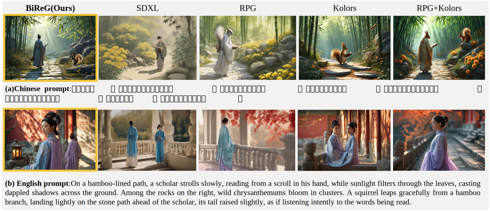

# BiReG: Adaptive Region Planning for Training-Free Bilingual Text-to-Image Generation

Official implementation of **BiReG**, a training-free framework for bilingual (Chinese-English) text-to-image generation with **LLM-driven adaptive region planning**.


<p align="center">
  
</p>

## 🔍 Overview

BiReG addresses a fundamental limitation in controllable text-to-image generation:

> Existing region-guided methods rely on fixed, English-centric templates, which fail to capture the semantic structure of Chinese prompts, especially in complex compositional scenarios.

To solve this, BiReG introduces an **LLM-driven adaptive region planning mechanism**, which:

- parses bilingual prompts (Chinese & English)
- infers spatial layout dynamically
- generates region-specific prompts
- injects them into diffusion models without retraining

---

## 🚀 Key Contributions
<table>
<tr>
<td width="45%">

- **Training-Free Framework**
  - No finetuning required
  - Compatible with existing diffusion backbones (Kolors, SDXL)

- **Adaptive Region Planning**
  - Dynamic layout inference (instead of fixed templates)
  - Supports hierarchical spatial structures

- **Bilingual Semantic Understanding**
  - Handles Chinese and English prompts directly
  - Preserves modifier–noun dependencies in Chinese

- **Region-Guided Diffusion Control**
  - Injects regional prompts into cross-attention layers
  - Improves spatial consistency and object alignment
</td>
<td width="55%">

</td>

</tr>
</table>

---

## 🧠 Framework Pipeline
<p align="center">
  
</p>

```text
Input Prompt (Chinese / English)
        ↓
Language Detection
        ↓
Prompt Structuring
        ↓
LLM Planner
        ↓
Structured Output:
    - Final split ratio
    - Regional prompt
        ↓
Region-Guided Diffusion
        ↓
Generated Image
```
## Repository Structure
```text
BiReG/
├── demo_infer.py
├── full_infer.py
├── planner.py
├── RegionalKolorsDiffusion_xl.py
├── template/
│   ├── template_zh.txt
│   ├── template_en.txt
├── config/
│   ├── api_config_example.json
├── outputs/
│   ├── demo/
│   ├── full/
```
## ⚙️ Installation
```text
git clone https://github.com/yourname/BiReG.git
cd BiReG
pip install -r requirements.txt
```
## 📥 Model Preparation
Prepare pretrained Kolors weights:
```text
<MODEL_ROOT>/Kolors/
├── text_encoder/
├── vae/
├── scheduler/
├── unet/
```
Set environment variable:
```text
export KOLORS_PATH=/path/to/Kolors
```
## 🔑 API Configuration
Create:
```text
config/api_config.json
```
Example:
```text
{
  "deepseek_api_key": "your_key",
  "openai_api_key": "your_key"
}
```
## 🔍 Demo (Stage 1: Deterministic Evidence)
To ensure full reproducibility, this stage uses fixed layout structures and region prompts, instead of LLM outputs.

👉 Purpose:
- eliminate LLM randomness
- reproduce paper results
- provide stable visual evidence
---
### 🧩 Case 1: Spatial Separation
Prompt:
```text

```
Split ratio:
```text

```
Regional prompt:
```text

```
### 🌍 Case 2:

### 🧠 Case 3:


---
### ▶️ Run Demo
```text
python demo_infer.py
```
## 🚀 Full Pipeline (Stage 2: Method Demonstration)
Unlike Stage 1, this stage demonstrates the core mechanism of BiReG.
---
### 🧠 What This Stage Shows
- LLM-based semantic parsing
- adaptive layout generation
- region-conditioned diffusion
---
### ▶️ Example (Chinese)
```text
python full_infer.py \
--prompt "上方是天空和远山，下方左边是旅人，下方右边是猫" \
--planner deepseek
```
LLM Output
```text
Final split ratio:
0.3,1;0.7,0.5,0.5
Regional Prompt:
天空高远，远山层叠 BREAK
左下角旅人，背包，站立 BREAK
右下角猫，细节清晰
```
🌍 English Example
```text
python full_infer.py \
--prompt "Sky on top, traveler bottom left, cat bottom right" \
--planner deepseek
```
### ⚠️ Note on LLM Variability
- Outputs may vary slightly across runs
- Structure remains consistent
- Semantics preserved
## 📄 Paper & Citation
## 📬 Contact
For questions, please contact the authors.
