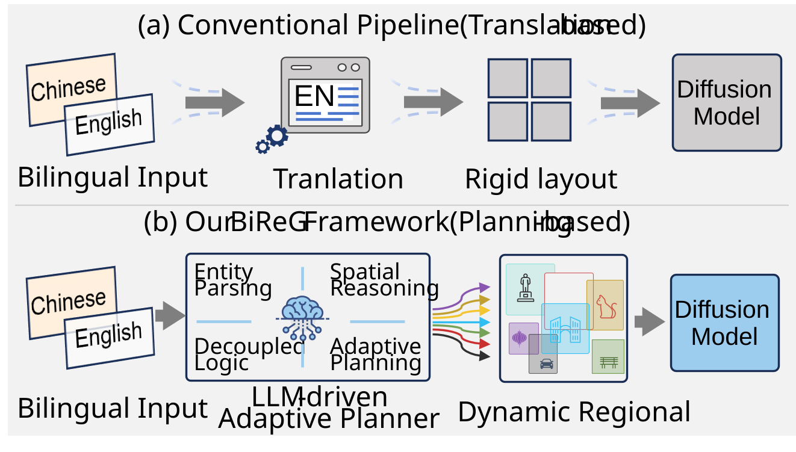
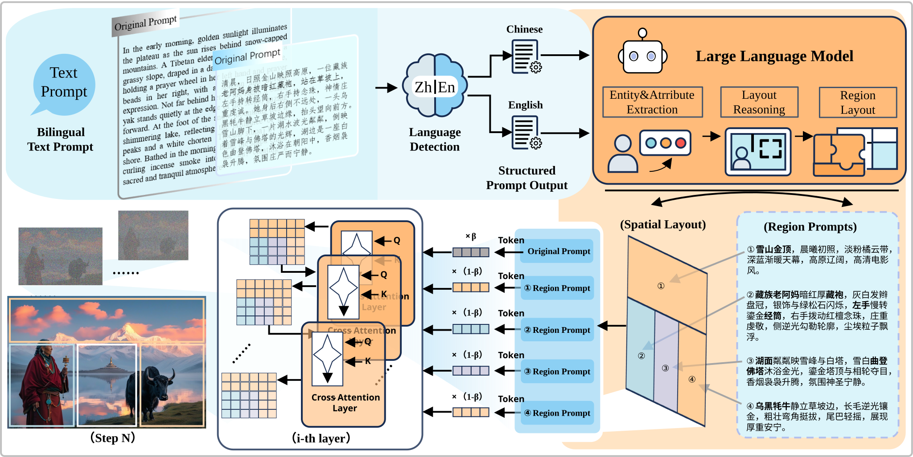

# BiReG: Training-Free Adaptive Region Planning for Bilingual Text-to-Image Generation
[](https://doi.org/10.5281/zenodo.19853901)

Official implementation of **BiReG**, a training-free framework for bilingual (Chinese-English) text-to-image generation with **LLM-driven adaptive region planning**.


<p align="center">
  
</p>

## Main-experiment reproduction

The [main-experiment guide](experiments/main_experiment/README.md) provides the frozen EN1920 and ZH150 prompt collections, six-pipeline generation and evaluation entries, archived automatic scores, statistical reproduction scripts, and image-download information. The main experiments cover 1,920 English and 150 Chinese-source prompts, with 37,260 retained images across six pipelines. Configuration, environment, and validation records accompany the corresponding entries. Use this guide for the retained main-experiment inputs and results; the demonstrations below illustrate method usage.


## 🔍 Overview

BiReG is a training-free framework for Chinese–English text-to-image generation. It connects language-aware prompt structuring, adaptive region planning, and generation control within a unified bilingual workflow.

Using language-specific structuring templates, an LLM converts a user prompt into regional descriptions and a spatial layout. The resulting plan guides a pretrained Kolors model through regional and global conditioning, without updating the diffusion backbone parameters.

## 🚀 Key Contributions
<table>
<tr>
<td width="45%">

- **Unified Bilingual Workflow**
  - Supports Chinese and English prompts through language-specific structuring templates.
  - Organizes entities, attributes, and relationships into regional descriptions and spatial layouts.

- **Adaptive Region Planning**
  - Uses LLM reasoning to infer region arrangements and split ratios from user descriptions.
  - Coordinates regional content with the planned spatial organization.

- **Training-Free Generation**
  - Guides a pretrained Kolors model without updating diffusion backbone parameters.

- **Regional–Global Conditioning**
  - Combines regional and global cross-attention outputs according to the planned layout.
  - Uses a fusion weight to control their relative contributions.
</td>
<td width="55%">

</td>

</tr>
</table>

---

## 🧠 Framework Pipeline
<p align="center">
  
</p>

```text
Input Prompt (Chinese / English)
        ↓
Language Detection
        ↓
Prompt Structuring
        ↓
LLM Planner
        ↓
Structured Output:
    - Final split ratio
    - Regional prompt
        ↓
Region-Guided Diffusion
        ↓
Generated Image
```
## Repository Structure
```text
BiReG/
├── demo_infer.py
├── full_infer.py
├── planner.py
├── RegionalKolorsDiffusion_xl.py
├── template/
│   ├── template_zh.txt
│   ├── template_en.txt
├── config/
│   ├── api_config_example.json
├── outputs/
│   ├── demo/
│   ├── full/
```
## ⚙️ Installation and Environment Records

```bash
git clone https://github.com/YeZhuang-Joe/BiReG.git
cd BiReG
```

Choose the entry point appropriate for your task:

- [Prompt-to-image workflow](generation/README.md): language routing, API-based regional planning, and Kolors generation.
- [Frozen main-experiment generation](experiments/main_experiment/generation/README.md): six-pipeline generation using the retained prompts, configurations, and saved plans.

Follow the environment, model preparation, and validation instructions in the corresponding guide. The entry points have separate recorded environments. The root `requirements.txt` is a historical dependency list, not a verified clean-install lock for all pipelines. The exact source revision of the recorded Diffusers development build remains to be identified.

## 🚀 Full Pipeline (Stage 2: Method Demonstration)
---
Unlike Stage 1, this stage demonstrates the core mechanism of BiReG.
---
### 🧠 What This Stage Shows
- LLM-based semantic parsing
- adaptive layout generation
- region-conditioned diffusion
---
### ▶️ Example (Chinese)
```text
python full_infer.py \
--prompt "上方是天空和远山，下方左边是旅人，下方右边是猫" \
--planner deepseek
```
LLM Output
```text
Final split ratio:
0.3,1;0.7,0.5,0.5
Regional Prompt:
天空高远，远山层叠 BREAK
左下角旅人，背包，站立 BREAK
右下角猫，细节清晰
```
🌍 English Example
```text
python full_infer.py \
--prompt "Sky on top, traveler bottom left, cat bottom right" \
--planner deepseek
```
### ⚠️ Note on LLM Variability
- Outputs may vary slightly across runs
- Structure remains consistent
- Semantics preserved

## 📄 Paper & Citation

This manuscript has been submitted to *The Visual Computer* for review.
If you find this code useful for your research, please consider citing the corresponding paper once it becomes publicly available. 

---

## License

Author-created BiReG software contributions are licensed under the [Apache License 2.0](LICENSE). Third-party code retains its original license conditions and copyright notices; see [NOTICE](NOTICE) and [THIRD_PARTY_NOTICES.md](THIRD_PARTY_NOTICES.md). The software license does not grant additional permissions to external model weights, benchmark datasets, generated images, or API services, which remain subject to their applicable terms.


## 📬 Contact
For questions, please contact the authors.
- **Zhuang Ye** – yj20242054@stud.tjut.edu.cn  
We welcome discussions and collaborations.
